# PubSub Event Processing

This package handles asynchronous event processing using NATS JetStream for the Lunogram platform.

## Architecture Overview

Events flow through a multi-stage pipeline that handles storage, schema extraction, dependency resolution, and triggers downstream processing for lists and journeys.

Scheduled update/delete propagation (rescheduling and cancellation of pending journey entrance states) is handled synchronously in the API controllers rather than through pubsub, since these operations have a single producer and don't benefit from asynchronous decoupling.

## Event Flow

```mermaid
graph TB
    Client[Client/API] -->|Submit User Event| EventSubject["users.events.process.{project_id}"]
    Client -->|Submit User| UserSubject["users.process.{project_id}"]
    Client -->|Submit Organization| OrgSubject["organizations.process.{project_id}"]
    Client -->|Submit Org User| OrgUserSubject["organizations.users.process.{project_id}"]
    Client -->|Submit Org Event| OrgEventSubject["organizations.events.process.{project_id}"]
    Client -->|Match User Event| MatchUserSubject["users.events.match.{project_id}"]
    Client -->|Match Org Event| MatchOrgSubject["organizations.events.match.{project_id}"]
    Client -->|Send Campaign| CampaignSubject["campaigns.send.{project_id}.{campaign_id}"]
    Client -->|Submit Scheduled| SchedSubject["scheduled.process.{project_id}"]
    Client -->|Create Offset| SchedBackfillSubject["scheduled.backfill.{project_id}"]
    Client -->|Send Broadcast| BroadcastSubject["broadcasts.process.{project_id}.{broadcast_id}"]
    Client -->|User Inbox Message| UserInboxSubject["users.inbox.process.{project_id}"]
    Client -->|User Inbox Opened| UserInboxOpenedSubject["users.inbox.opened.{project_id}"]
    Client -->|User Inbox Archived| UserInboxArchivedSubject["users.inbox.archived.{project_id}"]
    Client -->|Org Inbox Message| OrgInboxSubject["organizations.inbox.process.{project_id}"]
    Client -->|Org Inbox Opened| OrgInboxOpenedSubject["organizations.inbox.opened.{project_id}"]
    Client -->|Org Inbox Archived| OrgInboxArchivedSubject["organizations.inbox.archived.{project_id}"]
    Client -->|Project Event| ProjectEventSubject["projects.events.{organization_id}"]

    EventSubject -->|Consume| EventHandler["User Event Handler"]
    UserSubject -->|Consume| UserHandler["User Handler"]
    OrgSubject -->|Consume| OrgHandler["Organization Handler"]
    OrgUserSubject -->|Consume| OrgUserHandler["Organization User Handler"]
    OrgEventSubject -->|Consume| OrgEventHandler["Organization Event Handler"]
    MatchUserSubject -->|Consume| MatchUserHandler["Match User Event Handler"]
    MatchOrgSubject -->|Consume| MatchOrgHandler["Match Organization Event Handler"]
    CampaignSubject -->|Consume| CampaignHandler["Campaign Send Handler"]
    SchedSubject -->|Consume| SchedHandler["Scheduled Handler"]
    SchedBackfillSubject -->|Consume| SchedBackfillHandler["Scheduled Backfill Handler"]
    BroadcastSubject -->|Consume| BroadcastHandler["Broadcast Process Handler"]
    UserInboxSubject -->|Consume| UserInboxHandler["User Inbox Message Handler"]
    UserInboxOpenedSubject -->|Consume| UserInboxOpenedHandler["User Inbox Opened Handler"]
    UserInboxArchivedSubject -->|Consume| UserInboxArchivedHandler["User Inbox Archived Handler"]
    OrgInboxSubject -->|Consume| OrgInboxHandler["Organization Inbox Message Handler"]
    OrgInboxOpenedSubject -->|Consume| OrgInboxOpenedHandler["Organization Inbox Opened Handler"]
    OrgInboxArchivedSubject -->|Consume| OrgInboxArchivedHandler["Organization Inbox Archived Handler"]
    ProjectEventSubject -->|Consume| ProjectEventHandler["Project Event Handler"]

    %% Schema publishing
    EventHandler --> EventSchemaSubject["users.events.schema.{project_id}"]
    OrgHandler --> OrgSchemaSubject["organizations.schema.{project_id}"]
    OrgUserHandler --> OrgUserSchemaSubject["organizations.users.schema.{project_id}"]
    SchedHandler --> SchedSchemaSubject["scheduled.schema.{project_id}"]

    %% Recompute triggers from user events
    EventHandler -->|Affected Lists| ListSubject["lists.recompute.{project_id}.{list_id}"]
    EventHandler -->|Journey Entrance| EntranceSubject["journeys.entrance.{project_id}.{journey_id}.{user_id}"]

    %% Recompute triggers from match user events
    MatchUserHandler -->|Schema| EventSchemaSubject
    MatchUserHandler -->|Affected Lists| ListSubject
    MatchUserHandler -->|Journey Entrance per user| EntranceSubject

    %% Recompute triggers from users
    UserHandler -->|Affected Lists| ListSubject
    UserHandler -->|User system events| EventSubject
    UserHandler --> UserSchemaSubject["users.schema.{project_id}"]
    UserHandler -->|Anniversary Schedule| SchedSubject

    %% Recompute triggers from organizations
    OrgHandler -->|Affected Lists| ListSubject
    OrgHandler -->|Org system events| OrgEventSubject
    OrgHandler -->|Anniversary Schedule| SchedSubject
    OrgUserHandler -->|Affected Lists| ListSubject
    OrgUserHandler -->|Org user system events| OrgEventSubject

    %% Recompute triggers from organization events
    OrgEventHandler -->|Affected Lists| ListSubject
    OrgEventHandler -->|Journey Entrance per org user| EntranceSubject
    OrgEventHandler --> OrgEventSchemaSubject["organizations.events.schema.{project_id}"]

    %% Recompute triggers from match organization events
    MatchOrgHandler -->|Schema| OrgEventSchemaSubject
    MatchOrgHandler -->|Affected Lists| ListSubject
    MatchOrgHandler -->|Journey Entrance per org user| EntranceSubject

    %% Schema handlers
    EventSchemaSubject -->|Consume| EventSchemaHandler["User Event Schema Handler"]
    UserSchemaSubject -->|Consume| UserSchemaHandler["User Schema Handler"]
    OrgSchemaSubject -->|Consume| OrgSchemaHandler["Organization Schema Handler"]
    OrgUserSchemaSubject -->|Consume| OrgUserSchemaHandler["Organization User Schema Handler"]
    OrgEventSchemaSubject -->|Consume| OrgEventSchemaHandler["Organization Event Schema Handler"]
    SchedSchemaSubject -->|Consume| SchedSchemaHandler["Scheduled Schema Handler"]

    %% Action schema publishing (via JetStream)
    ActionSchemaSubject["actions.schema.{project_id}"] -->|Consume| ActionSchemaHandler["Action Schema Handler"]

    ListSubject -->|Consume| ListRecompute["List Recomputation"]
    EntranceSubject -->|Consume| EntranceHandler["Journey Entrance Handler"]
    JourneySubject["journeys.advance.{project_id}.{journey_id}.{user_id}"] -->|Consume| JourneyState["Journey State Handler"]

    %% Journey entrance produces advancement
    EntranceHandler -->|Eligible: advance| JourneySubject

    %% Journey self-advancement and completion
    JourneyState -->|Child Steps| JourneySubject
    JourneyState -->|Journey Completed| StepExecutedSubject["journeys.step_executed.{project_id}.{journey_id}.{user_id}"]
    JourneyState -->|Action Schema| ActionSchemaSubject

    %% Action execution via NATS request/reply
    Client -.->|Request/Reply| ActionExecute["actions.execute.{project_id}"]
    ActionExecute -.->|Consume| ActionHandler["Action Execute Handler"]
    ActionHandler -.->|Reply| Client
    ActionHandler -->|Schema Extract| ActionSchemaSubject

    %% Action validation via NATS request/reply
    Client -.->|Request/Reply| ActionValidate["actions.validate.{project_id}"]
    ActionValidate -.->|Consume| ActionValidateHandler["Action Validate Handler"]
    ActionValidateHandler -.->|Reply| Client

    %% Email rendering via NATS request/reply
    CampaignHandler -.->|Compile Request/Reply| EmailCompile["email.compile.{project_id}"]
    CampaignHandler -.->|Render Request/Reply| EmailRender["email.render.{project_id}"]

    %% Campaign inbox lifecycle events and dispatch
    CampaignHandler -->|Inbox Created Event| EventSubject
    CampaignHandler -->|Push Dispatch| UserInboxDispatchSubject["users.inbox.dispatch.{project_id}"]

    ListRecompute -->|List Membership Change| EventSubject

    %% Broadcast fan-out
    BroadcastHandler -->|First Batch| BroadcastBatchSubject["broadcasts.batch.{project_id}.{broadcast_id}"]
    BroadcastBatchSubject -->|Consume| BroadcastBatchHandler["Broadcast Batch Handler"]
    BroadcastBatchHandler -->|Send per user| CampaignSubject
    BroadcastBatchHandler -->|Next Batch| BroadcastBatchSubject

    %% Inbox lifecycle events
    UserInboxHandler -->|Lifecycle Event| EventSubject
    UserInboxHandler -->|Push Dispatch| UserInboxDispatchSubject
    UserInboxOpenedHandler -->|Lifecycle Event| EventSubject
    UserInboxArchivedHandler -->|Lifecycle Event| EventSubject
    OrgInboxHandler -->|Lifecycle Event| OrgEventSubject
    OrgInboxHandler -->|Push Dispatch| OrgInboxDispatchSubject["organizations.inbox.dispatch.{project_id}"]
    OrgInboxOpenedHandler -->|Lifecycle Event| OrgEventSubject
    OrgInboxArchivedHandler -->|Lifecycle Event| OrgEventSubject

    %% Inbox push dispatch handlers
    UserInboxDispatchSubject -->|Consume| UserInboxDispatchHandler["User Inbox Dispatch Handler"]
    OrgInboxDispatchSubject -->|Consume| OrgInboxDispatchHandler["Organization Inbox Dispatch Handler"]
```

