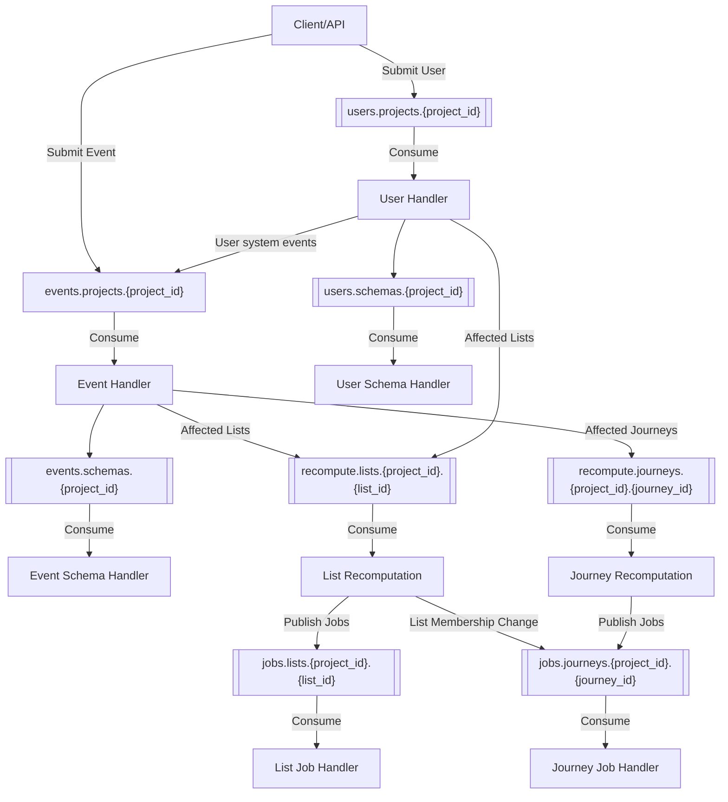

# PubSub Event Processing

This package handles asynchronous event processing using NATS JetStream for the Lunogram platform.

## Architecture Overview

Events flow through a multi-stage pipeline that handles storage, schema extraction, dependency resolution, and triggers downstream processing for lists and journeys.

## Event Flow

